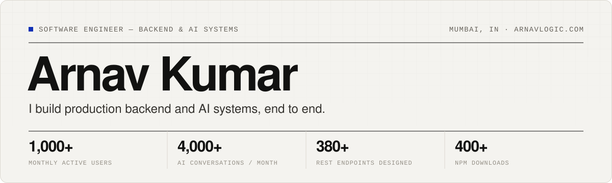

<picture>
  <source media="(prefers-color-scheme: dark)" srcset="assets/header-dark.svg">
  
</picture>

I'm a software engineer who ships production backend and AI systems end to end. Right now I'm an **AI Systems Engineer at Sure Financial**, building a multi-agent LLM platform that 1,000+ people use every month. Before that I was the **sole backend engineer** on a multi-tenant telephony and payments SaaS for US insurance agencies.

**[arnavlogic.com](https://arnavlogic.com)** · [Resume (PDF)](https://arnavlogic.com/resume.pdf) · [LinkedIn](https://www.linkedin.com/in/arnav-kumar-0873322aa/) · [kumararnav028@gmail.com](mailto:kumararnav028@gmail.com)

Open to SDE, backend and AI engineering roles.

## Experience

**AI Systems Engineer · Sure Financial** &nbsp;·&nbsp; Jan 2026 – present 
Python · FastAPI · Google ADK · Gemini · Go (Gin, GORM) · PostgreSQL · Firestore · GCP Cloud Run · Langfuse

- Architected and shipped a production AI financial-advisory platform: **1,000+ monthly active users** and **4,000+ AI conversations a month**. Versioned, structured LLM outputs drive dynamic widgets in the Flutter app.
- Designed a coordinator-to-specialist **multi-agent system** (intent routing, advisor, tool and UI actions, a loan-negotiation journey) with a parallel "thinking" agent for faster perceived responses.
- Cut hallucinations with deterministic grounding: compact per-user context cards, plus a post-response check that every institution named actually exists in the user's linked accounts.
- Removed cross-user context leakage across concurrent async sessions by isolating per-request state with Python `ContextVar`s.
- Built a Go microservice that syncs profiles and events to MoEngage through a governed event catalog, and added Langfuse tracing with per-agent cost attribution and routing-drift detection.

**Lead Backend Engineer (Contract) · inboundSelect** &nbsp;·&nbsp; Dec 2025 – Jun 2026 · US client, remote 
Node.js · Express · PostgreSQL · Redis · Bull · Socket.IO · Twilio · Stripe Connect · AWS (S3, SES, SNS)

- Sole backend engineer for a multi-tenant pay-per-call SaaS: **380+ REST endpoints**, a ~60-table PostgreSQL schema across 105 migrations, and real-time dashboards.
- Built a **real-time call-routing engine** (Twilio Voice, Socket.IO) that guarantees exactly-once agent assignment under concurrent accepts with an atomic conditional `UPDATE`.
- Built **multi-tenant payments on Stripe Connect**: per-agency connected accounts, prorated subscriptions, overdraft-safe prepaid wallets and per-call platform fees, all idempotent.
- Automated invoicing, fee collection, re-billing and stuck-call cleanup with 9 scheduled Bull/Redis jobs (retries, backoff, in-process fallback if Redis is down), and verified signatures on all 9 webhook endpoints.

**Backend Engineer Intern · Exploria** &nbsp;·&nbsp; Apr – Jun 2025 
Node.js · Express · AWS S3 · AWS Lambda

- Built REST APIs with request validation, automated tests and API docs, and integrated S3 storage and Lambda functions into backend workflows.

## Selected work

Client code is private, so each project links to a written case study with the architecture and the decisions behind it.

| Project | What it is | Stack |
| --- | --- | --- |
| [**inboundSelect**](https://arnavlogic.com/projects/inboundselect) | Real-time call routing and billing for US insurance agencies | Node.js, PostgreSQL, Redis, Twilio, Stripe Connect |
| [**Royal Algae**](https://arnavlogic.com/projects/royal-algae) | Live D2C store ([nhhw.in](https://nhhw.in)). Orders are created only after Razorpay's signature checks out, inside a row-locked transaction | Laravel 12, React 19, MySQL, Razorpay |
| [**BuildFlowCRM**](https://arnavlogic.com/projects/buildflowcrm) | CRM for commercial real estate where every employee edit waits for a manager's approval | Node.js, MongoDB, React, Cloudflare R2 |
| [**AI portfolio assistant**](https://arnavlogic.com) | Streaming Gemini agent with function calling, per-user token quotas in Redis and a monthly spend cap | Next.js, Express, Gemini, Upstash Redis |

## Open source

**[mongoose-zod-schema-builder](https://github.com/arnav14-dev/mongoose-zod-schema-builder)** &nbsp;  
Generates a Mongoose schema and a Zod schema from one definition, so database models and API validation can't drift apart. Three releases, 400+ downloads.

Other public repos worth a look: [Bondy](https://github.com/arnav14-dev/Bondy-Someone-By-Your-Side) (real-time companion booking, MERN + Socket.IO), [360° Agri](https://github.com/arnav14-dev/SIH-Demo) (Smart India Hackathon prototype) and [Credit-Card-Statement-Parser](https://github.com/arnav14-dev/Credit-Card-Statement-Parser) (PDF statement extraction for five Indian banks).

## Stack

- **Languages:** Python, TypeScript, JavaScript, Go, SQL, PHP, Java
- **Backend:** Node.js, Express, FastAPI, Gin, Laravel, REST, WebSockets (Socket.IO), Bull/Redis queues, webhooks, JWT, OAuth
- **AI / LLM:** Google ADK, Gemini, multi-agent orchestration, tool calling, structured outputs, RAG, LangGraph, Langfuse
- **Data:** PostgreSQL, MySQL, MongoDB, Redis, Firestore, Supabase
- **Cloud:** AWS (S3, SES, SNS, Lambda), GCP (Cloud Run, Cloud SQL), Cloudflare R2, Railway, Vercel, GitHub Actions
- **Frontend & integrations:** React, Next.js, Tailwind CSS, Stripe Connect, Twilio, Razorpay

## Education

B.Tech in Computer Engineering, K J Somaiya College of Engineering, Mumbai (2022 – 2026)
